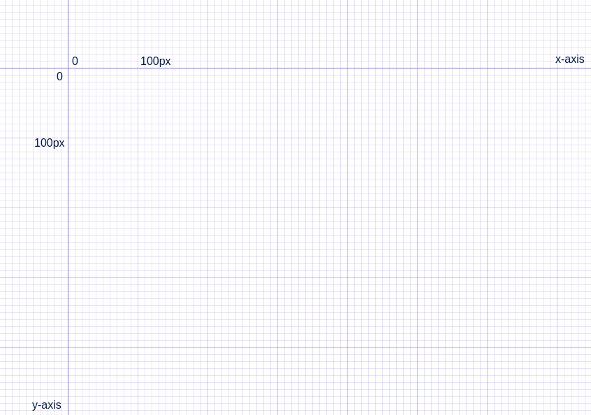

# svg-icons

How to Hand Code SVG: https://webdesign.tutsplus.com/tutorials/how-to-hand-code-svg--cms-30368

Source: https://github.com/tutsplus/how-to-hand-code-svg

## "SVG canvas"
"SVG canvas" consists of <code>div</code> with class <code>.grid</code> and represents <em>x</em> & <em>y axis</em>.
Each of the lightest grid lines represents 10px and the medium thickness lines represent 100px;

SVG element is initially placed so its top left corner aligns with the place <em>x</em> and <em>y axis</em> intersect.
As such, that intersection point represents the position <code>x = "0"</code> and <code>y = "0"</code>.
 

 
So moving and object from one medium thickness line would increase/decrease its location.

### Instructions
SVG initial settings are placed in <em>index.css</em> file. You may want to adjust them, e.g. <code>stroke-width</code>, or directly set stroke color and fill on your svg element.

Note the <em>stroke width</em>. This means that you may need to provide offset of about a half of <code>stroke-width</code> value both to <i>x</i> and <i>y</i> positions.

You may also want to start drawing you SVG icon with giving <code>svg</code> element your icon's canvas size by setting its <code>width</code> and <code>height</code>.

To control stroke and fill color group icon's parts by <code>g</code> in order to provide them with classes to style them.

When finished, provide to your SVG <code>xmlns="http://www.w3.org/2000/svg"</code> attribute and <em>viewBox</em> with its sizes got from "SVG canvas" dimensions, 
e.g. <code>viewBox="0 0 27 27"</code>.
